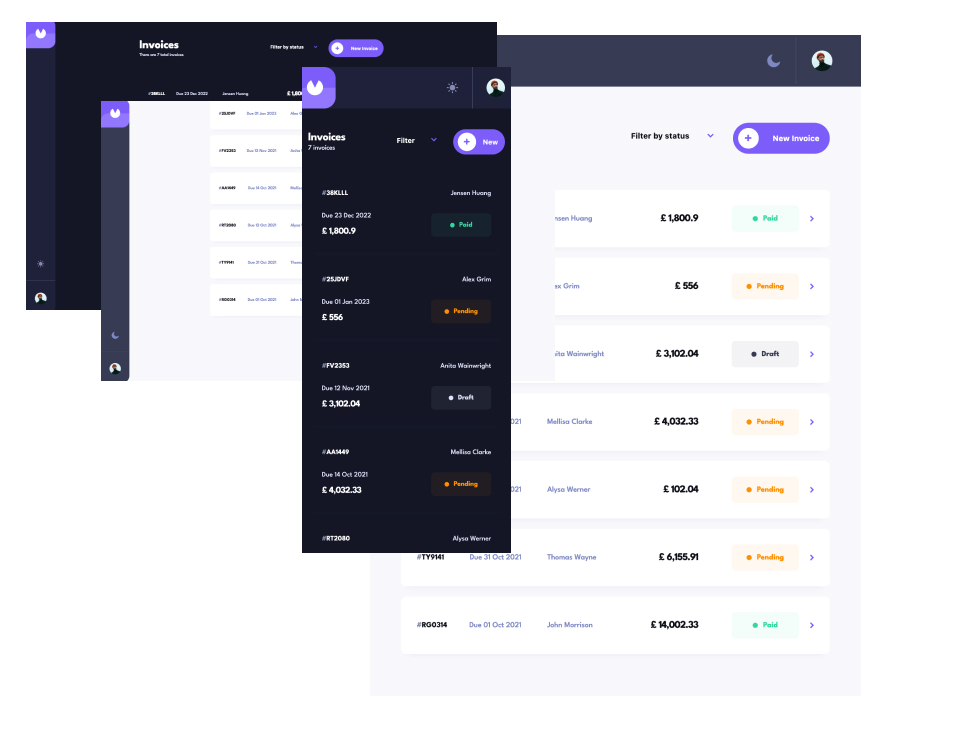

# Frontend Mentor - Invoice app solution

This is a solution to the [Invoice app challenge on Frontend Mentor](https://www.frontendmentor.io/challenges/invoice-app-i7KaLTQjl). Frontend Mentor challenges help you improve your coding skills by building realistic projects.

## Table of contents

- [Overview](#overview)
  - [The challenge](#the-challenge)
  - [Screenshot](#screenshot)
  - [Links](#links)
- [My process](#my-process)
  - [Built with](#built-with)
  - [What I learned](#what-i-learned)
  - [Continued development](#continued-development)
- [Author](#author)

## Overview

### The challenge

Users should be able to:

- View the optimal layout for the app depending on their device's screen size
- See hover states for all interactive elements on the page
- Create, read, update, and delete invoices
- Receive form validations when trying to create/edit an invoice
- Save draft invoices, and mark pending invoices as paid
- Filter invoices by status (draft/pending/paid)
- Toggle light and dark mode
- **Bonus**: Keep track of any changes, even after refreshing the browser (`localStorage` could be used for this if you're not building out a full-stack app)

### Screenshot



### Links

- Solution URL: [Add solution URL here](https://your-solution-url.com)
- Live Site URL: [Add live site URL here](https://your-live-site-url.com)

## My process

### Built with

- Semantic HTML5 markup
- CSS custom properties
- Flexbox
- CSS Grid
- Mobile-first workflow
- [Remix](https://remix.run/)
- [React](https://reactjs.org/) - JS library
- [Next.js](https://nextjs.org/) - React framework
- [Styled Components](https://styled-components.com/) - For styles
- [Prisma](https://www.prisma.io/) - For database management
- [MongoDb](https://www.mongodb.com) - For database model

### What I learned

This was a challenging project, i extended it by making it a fullstack application and including authentication for users. I learnt alot about managing the backend and creating request to the server which has been made easier by the remix framework built on top of react and prisma.

```js
const proudOfThisFunc = () => {
  console.log("Hello user add an invoice🎉");
};
```

### Continued development

I would like to focus on learning how to better optimize website in terms of scalability and speed. I plan to learn and build my next project using typescript to improve my experience and add type safety to my projects.

## Author

- Frontend Mentor - [@joshysmart](https://www.frontendmentor.io/profile/joshysmart)
- Twitter - [@saniojoshua](https://www.twitter.com/saniojoshua)
